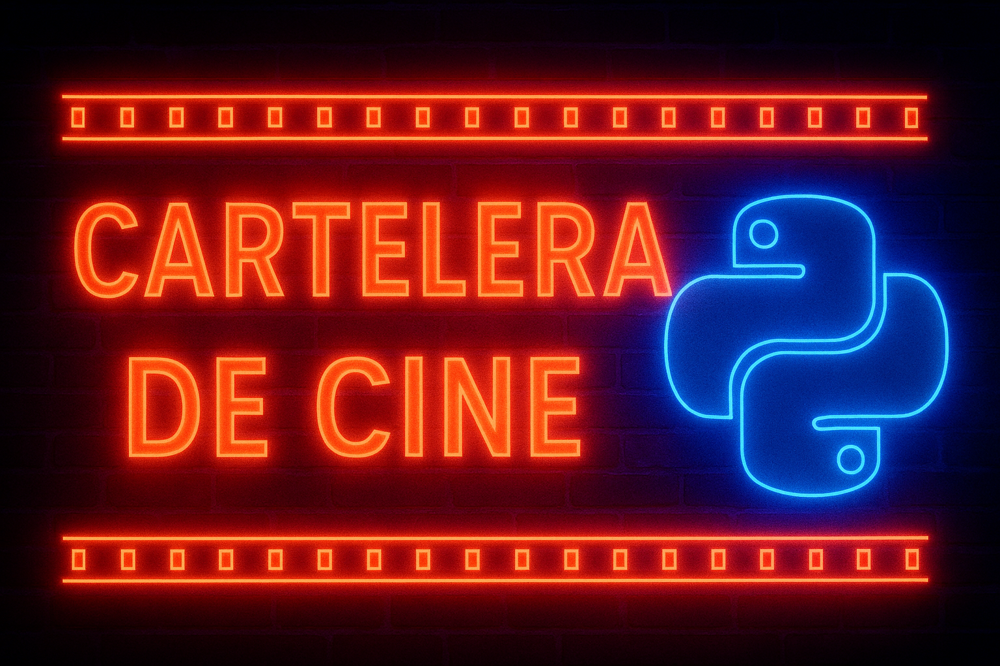

  

_🎥 La magia del cine… programada en Python 🐍🍿_

Bienvenido al repositorio de **Cartelera de Cine**, un proyecto desarrollado en Python cuya finalidad es gestionar y mostrar una cartelera digital de películas.

## 🎯 Finalidad del Proyecto

El objetivo principal es construir una aplicación en Python que permita:

* 📌 Mostrar información de películas en cartelera
* 🕒 Organizar por horarios y salas
* 🎫 Gestionar datos como género, duración, clasificación, etc.
* ✅ Practicar programación estructurada y/o POO

Este proyecto forma parte de nuestro aprendizaje en Python dentro del curso **Python + IA**.

## 👥 Integrantes del Equipo

* Javier Cachón Garrido
* Kary Haro Pérez
* Manuel Jesús Marín García
* Reyes Delestal Barrios
* Iñaki Huete Montes

## 🚀 Cómo usar el proyecto

Próximamente incluiremos instrucciones claras sobre cómo ejecutar la cartelera, dependencias, estructura del código y casos de uso.

## 🛠️ Tecnologías utilizadas

* Python 3
* SQLAlchemy (ORM)
* SQLite (Base de datos)
* Programación orientada a objetos (POO)
* Estructuras de datos

## ✨ Futuras Mejoras

* 🎦 Añadir posibilidad de compra de entradas
* 🎭 Filtros por género, clasificación y duración
* 🍿 Diseño gráfico más cinematográfico en consola

---

✨ *Proyecto en constante evolución. ¡Próximamente más detalles!* 🎥
